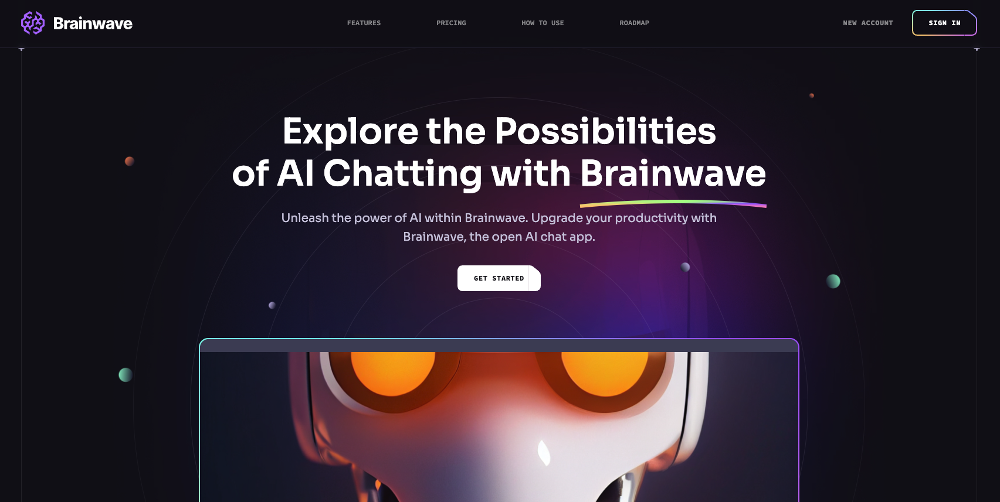

# BRAINWAVE Webpage 🚀

Welcome to **Brainwave**—a sleek and fully mobile-responsive webpage crafted with **React** and **Tailwind CSS**. This project boasts an amazing UI that’s optimized for all devices, offering a smooth and intuitive user experience.

## Features ✨

- 📱 **Responsive Design:** Fully optimized for mobile, tablet, and desktop views.
- 🎨 **Modern UI:** Clean and stylish interface designed with user experience in mind.
- ⚡ **Built with React & Tailwind CSS:** Leveraging powerful tools for fast and efficient development.

## Preview 👀

Check out the live demo [here](https://brainwave-nb.netlify.app/).

## Installation

Clone the repo and install dependencies:

## Technologies Used

- **React**
- **Tailwind CSS**
